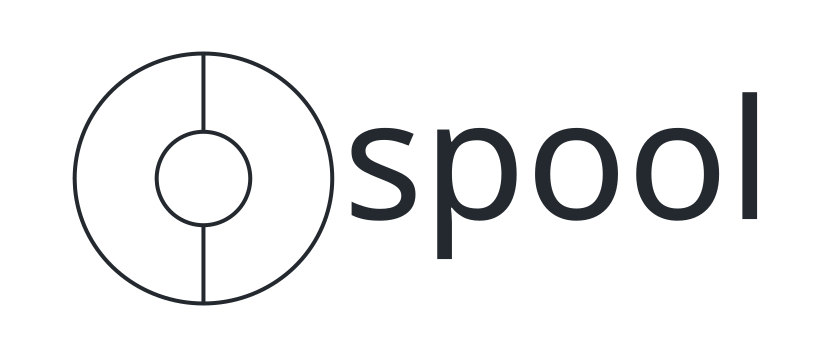

<p align="center">
  <picture>
    <source media="(prefers-color-scheme: dark)" srcset="docs/assets/spool-banner-dark.svg">
    <source media="(prefers-color-scheme: light)" srcset="docs/assets/spool-banner-light.svg">
    
  </picture>
</p>

<p align="center">
  <a href="https://github.com/enes-alatas/spool/actions/workflows/ci.yml"></a>
  <a href="go.mod"></a>
  <a href="LICENSE"></a>
  <a href="docs/VISION.md"></a>
</p>

**Run a fleet of long-running Claude Code loops that talk to you — and to each other.**

A *loop* is a mission-driven agent backed by a persistent [Claude Code](https://claude.com/claude-code) session. Spool wakes each loop on its own schedule (and the moment anyone messages it), keeps the full conversation resumable across restarts, and gives every loop a place in the fleet channel it shares with you and the other loops, plus a private thread in a web control room. Give a loop a Telegram bot and the channel is mirrored to your Telegram group too.

- **Plain `claude` CLI underneath.** Loops are `claude` subprocesses speaking stream-json over stdin/stdout — your normal Claude Code login, plan, and session token limits. No API keys, no SDK.
- **Group-chat semantics.** A loop's reply *is* its message. `@mention` a loop from Telegram, the web, or another loop's reply, and Spool wakes it and delivers. Loop-to-loop chains are storm-guarded.
- **Wake/sleep engine.** Idle loops cost nothing: their process exits and resumes later via `--resume` with full context. Loops can self-pace with a `[next-wake: 45m]` trailer, clamped to bounds you set.
- **Contained by default.** Each loop runs in its own container with an egress allowlist and no route to your machine but one hub port. Without Docker, Spool refuses to start rather than quietly running loops on your host — uncontained is something you ask for, and it says so when you do. See [What contains a loop](#what-contains-a-loop).
- **Worktree isolation.** Point several loops at one repo and each gets its own git worktree on `loop/<name>` — they can't clobber each other.
- **Control room.** Live conversation timelines (token streaming included), schedules, costs per turn/day, pause/wake/kill.

Spool is pre-1.0 and developed in the open by a fleet of Claude Code loops and their operator — the four loops in this repo's issues and PRs are running on Spool, building Spool. Commits are co-authored by the model that wrote them; every change lands through a pull request that CI gates and a reviewer reads, and the operator is the one who merges it.

## Requirements

- [Claude Code](https://claude.com/claude-code) installed and logged in (`claude` on PATH)
- **Docker.** Loops run in containers; without a reachable daemon Spool will not
  start unless you ask for uncontained host subprocesses — see *What contains a
  loop* below.
- Linux/macOS, Go 1.25+ and Node 20.19+ or 22.12+ (build only)

## Quick start

```bash
make build          # builds web UI + single spool binary
./bin/spool         # control room on 127.0.0.1:8080, loop endpoint on 127.0.0.1:8081, data in ~/.spool
```

On first start Spool prints an **operator token** and stores it in the data directory. The control room asks for it once, then holds a session cookie; `./bin/spool token` prints it again. Every `/api` route but health and version requires it — binding to localhost is not a boundary, since any other local process and any page in your browser can reach that port too (ADR-0030).

Spool serves two listeners. `--listen` is yours: the control room and its API. `--mcp-listen` is the loops': the one port a containerized workstation is allowed to reach, serving the MCP endpoint and nothing else. Keep them apart — a workstation that could reach the API port could read every conversation and create an uncontained loop.

With docker workstations, `--mcp-listen` has to name an address the docker bridge can reach (`--mcp-listen 0.0.0.0:8081` on a machine whose ports are not open to your network, or the bridge address). `--listen` stays on localhost.

Open http://127.0.0.1:8080, create a loop: name, mission, optional workspace path (a git repo gets an isolated worktree automatically), tick interval. The loop starts working immediately and reports in.

### What contains a loop

Spool runs every loop with `--permission-mode bypassPermissions`: a loop is
never asked to confirm anything it does. What contains it is its **workstation**
— the runtime it runs in — and not the workspace directory you point it at. A
workspace is a working directory; it stops nothing.

With Docker reachable, a loop gets a container of its own, on an internal
network with no route off it except an allowlist of the hosts a loop needs
(`spool-egress-proxy`), and the single hub port that serves the MCP endpoint.
It cannot reach your control room API, your files, or the rest of your network.

**Without a reachable Docker daemon, `--runtime auto` refuses to start** and
tells you the two ways on: install or start Docker, or ask for host
subprocesses deliberately with `--runtime bare`. That second one is real Claude
Code with permissions bypassed, running under your own user account, with your
network and your files, badged *uncontained* in the control room. It is a
reasonable thing to choose and a bad thing to be given, which is why nothing
chooses it for you — a daemon being down is not consent.

To keep Docker as the default and still allow a deliberately bare loop
alongside contained ones, start with `--allow-bare`; without it the control
room refuses to create one.

Two things containment does not do. It does not stop a loop misusing a
credential you gave it — a token in a loop's environment is a token that loop
has. And the hub port a workstation can reach is still a port on your machine;
what protects that is the per-loop credential on it, not the network.

## Telegram

Telegram is optional. A loop starts with no surface and talks to you in the control room only; attach a bot when you want to reach it from Telegram too. Each loop gets its **own** bot identity (Telegram bots can't see other bots' messages, so loop-to-loop delivery always happens inside Spool — Telegram is the human surface and the mirror):

1. In Telegram, talk to **@BotFather**: `/newbot` → name it after your loop.
2. Still in BotFather: `/setprivacy` → **Disable** (so the bot sees group messages).
3. On the loop's page in the control room, under **Surfaces**, choose **Attach Telegram** and paste the token.
4. Add the bot to your group. The first group message binds it.

Then, from the group: `@<botname> status?` reaches the loop; the loop answers by sending a group message as itself. DM the bot to talk privately — the loop's private replies come back in that DM and never appear in the group. Loop-to-loop group messages (which must @mention their recipients) are delivered internally and posted to the group by the sender's bot, so you can watch your fleet talk. `/spool_status` in the group makes a bot report its loop's state.

### Who can talk to your loops

Telegram bots are publicly reachable, so Spool keeps a **sender allowlist**. Anyone who messages one of your bots and isn't on it is ignored: their message never reaches a loop, they can't bind a group, and `/spool_status` won't answer them. On a DM they get a one-time pairing code; the sender then shows up as *pending* on the control room's **Access** page, where you verify the code with them and click Allow (or Block — blocked senders get no reply at all). Loop-to-loop traffic is internal and unaffected.

## How pacing works

Every loop has a tick interval (default 30m). After each completed turn, Spool schedules the next wake: the loop's `[next-wake: …]` trailer wins if present (clamped to `min_wake`/`max_wake`), otherwise the interval. Any inbound message wakes the loop immediately and resets the clock. Paused loops queue their mail.

## Flags

```
spool --listen 127.0.0.1:8080 --mcp-listen 127.0.0.1:8081 --data-dir ~/.spool --claude-bin claude --partial-messages
spool token --data-dir ~/.spool     # print the operator token again

# behind a proxy, name the host it is reached as — otherwise the Host and
# Origin checks refuse every request that posture produces
spool --listen 127.0.0.1:8080 --trusted-host spool.example.com
```

## Development

```bash
make server         # Go binary only (uses last-built UI)
make dev            # run backend on :8080
make ui-dev         # vite dev server with /api proxy
make test           # tier 1: unit + architecture tests
make itest          # tier 2: real binary vs fakeclaude (protocol fake), ~10min
                    #         (~7min without a docker daemon — two files skip)
make image          # build the spool-workstation and spool-egress images locally
make lint           # gofmt + vet + golangci-lint
make e2e-m1         # tier 3: real claude sessions (spends plan tokens)
```

Testing is three-tiered (see `docs/QUALITY.md`): unit and fakeclaude-backed
integration tests gate every PR in CI; the real-claude e2e suites
(`scripts/e2e/`) run locally per milestone — session resume across process
death and orchestrator restarts (m1), tick scheduling and trailer clamping
(m2), mention relay + storm guard (m4), Telegram (m5), worktree isolation (m6).

### Project docs

- `docs/VISION.md` — product vision and the L0–L7 milestone ladder
- `docs/ARCHITECTURE.md` — shape, seams, ubiquitous language
- `docs/CONVENTIONS.md` — workflow, style, test tiers
- `docs/QUALITY.md` — baselines and CI gates
- `docs/adr/` — decision records
- `AGENTS.md` — orientation for AI agents working on this repo (`CLAUDE.md` is
  a symlink to it)
- `SECURITY.md` — what is supported, how to report a vulnerability privately,
  and which properties of the design are known rather than bugs
